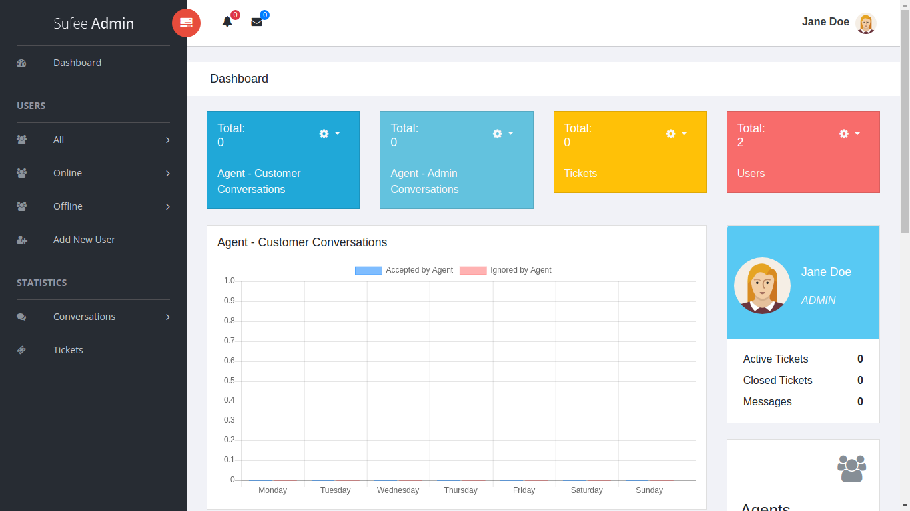

# Customer Agent System




This project have been created by me while I was doing my second internship at [ODC Business Solutions](https://www.smartmessage.com/) to integrate with an existing [app](https://www.smartmessage.com/bot-builder/).

This app's goal is to allow customers to talk with real customer agent rather than a bot. Normally the [app](https://www.smartmessage.com/bot-builder/) allows you to react out your customers and also allows your customers to reach out you by multiple channels. For example a customer can reach you via facebook messanger by talking to a bot.

However, sometimes bots cannot be enough for your customer needs and problems. In these situations this app comes between your customer and the real agent by deactivating the bot. It allows the customer and the real agent to talk.

Most probably some of the features will not work because as I mentioned, the project have been created to integrate with the existing [app](https://www.smartmessage.com/bot-builder/) and it needs some external apis. But you can run the project and can try it.

The project created with Java 8 and [Spring boot](https://spring.io/projects/spring-boot) and uses websocket technology. It uses [H2 In Memory Database](https://www.h2database.com/html/main.html) as default to run and try quickly. For the front-end, I have used <b>free ready to use responsive html template</b>.

There two types of users *<u>Admin</u>* and *<u>Agent</u>*.

Admin privileges:
* Has dashboard.
* Add, remove or edit agents.
* Display his/her own and all agents' details of conversation that have made with customer and admins.
* Display his/her own and all agent's tickets and their status.
* Display all online and offline agents and admins.
* Display his/her own messages that have sent over the system.
* Edit his/her own profile.
* Send message over the system to other users.
* Search and filter most of the data.

Agent privileges:
* Has dashboard.
* Update his/her own online status. The status is used to find an agent to connect him/her with the customer. If an agent connects with a customer, his/her status becomes busy automatically.
* Display his/her own messages that have sent over the system.
* Display his/her own tickets and their status.
* Display all online and offline agents and admins.
* Send message over the system to other users.
* Display his/her own details of conversation that have made with customer and admins.
* Search and filter most of the data.

To run the project:
```
mvn spring-boot:run
```
